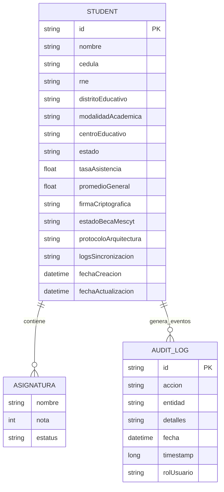

# EDUMETRICS-DR: Sistema de Telemetría Educativa Dominicana

## Descripción
Backend de la plataforma integrada MINERD-MESCYT para la gestión de expedientes estudiantiles, telemetría educativa y sincronización de datos entre instituciones del sector educativo dominicano.

## Arquitectura del Proyecto

- **Backend:** API REST construida con .NET 8 Core.
- **Base de Datos:** MongoDB.
- **Frontend:** Aplicación desarrollada con React y Tailwind CSS.

## Diagrama Entidad-Relación



## Requisitos Previos

- .NET 8 SDK
- MongoDB

## Configuración y Ejecución

### Variables de Entorno

- **Windows:** `set DATABASE_URL=mongodb://localhost:27017/edumetrics`
- **Linux/macOS:** `export DATABASE_URL=mongodb://localhost:27017/edumetrics`

### Comandos

1. **Instalar:** `cd backend` y `dotnet restore`.
2. **Compilar:** `dotnet build`.
3. **Ejecutar:** `dotnet run --configuration Development`.

## Endpoints Principales

- GET /api/AllExampleData
- POST /api/CreateExample
- PUT /api/ChangeExampleData/{id}
- DELETE /api/DeleteExample/{id}

## Matriz de Trazabilidad (Entidades vs. Endpoints)

| Entidad | Endpoint Base | GET | POST | PUT | PATCH | DELETE | Cobertura |
|---|---|---|---|---|---|---|---|
| Student | /api | /AllExampleData | /CreateExample | /ChangeExampleData/{id} | /PatchExampleData/{id} | /DeleteExample/{id} | CRUD completo |
| AuditLog | N/A (interno) | N/A | N/A | N/A | N/A | N/A | Registro automático de auditoría en operaciones POST/PUT/PATCH/DELETE de Student |
| Asignatura | Embebida en Student | /AllExampleData (dentro de Student.asignaturas) | /CreateExample (dentro de payload Student) | /ChangeExampleData/{id} (reemplazo de lista) | /PatchExampleData/{id} (si se envía en updates) | /DeleteExample/{id} (elimina Student y sus asignaturas embebidas) | Sin endpoint propio; gestionada a través de Student |

## Despliegue (Docker)

```dockerfile
FROM mcr.microsoft.com/dotnet/sdk:10.0 AS build
WORKDIR /src
COPY ["EDUMETRICS-DR.csproj", "./"]
RUN dotnet restore "EDUMETRICS-DR.csproj"
COPY . .
RUN dotnet publish "EDUMETRICS-DR.csproj" -c Release -o /app/publish

FROM mcr.microsoft.com/dotnet/aspnet:10.0 AS final
WORKDIR /app
COPY --from=build /app/publish .
EXPOSE 8080
ENTRYPOINT ["dotnet", "EDUMETRICS-DR.dll"]
```

## Soporte
Contacto: sergiovargasdiaz316@gmail.com

## Galería del Proyecto

Espacio visual para evidencias funcionales del sistema EDUMETRICS-DR.

- Pantalla principal de gestión de estudiantes.
- Reportes de Inteligencia de Negocios (KPIs y distribución).
- Flujo de creación y eliminación de registros.
- Ejecución de API en entorno local y productivo.
